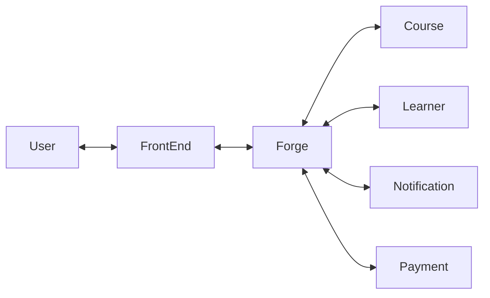
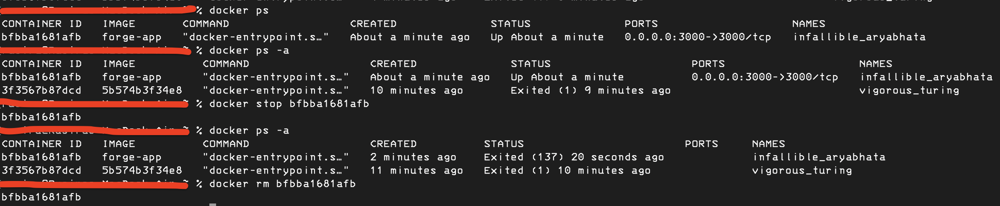

[GitHub Repository Of The Frontend](https://github.com/IT21292422/forge-app)
<p align="center">
  <a href="http://nestjs.com/" target="blank"></a>
</p>

[circleci-image]: https://img.shields.io/circleci/build/github/nestjs/nest/master?token=abc123def456
[circleci-url]: https://circleci.com/gh/nestjs/nest

<h1 align="center">Micro-Services with NestJS</h1>

[Read More about NestJS](https://github.com/nestjs/nest)

[Watch project initialization](https://youtu.be/3_jJK5NMGzs?si=A7Ve1cSm4A71oCGi)

## Basic project structure



### Installation

```bash
npm install
```

### Running the app

#### forge(auth) - start this before any service

```bash
npm run start:dev
```

#### for services (developing mode)

```bash
npm run start-notifications:dev
```

```bash
npm run start-payment:dev
```

```bash
npm run start-course:dev
```

```bash
npm run start-learner:dev
```

#### To run build files

```bash
node dist/apps/forge/main.js
```

## Test

```bash
# unit tests
npm run test

# e2e tests
npm run test:e2e

# test coverage
npm run test:cov
```

### Create Docker image

#### From the root folder run this command (only for forge service)

```bash
docker build -t forge-app -f Dockerfile .
```

- for other services this Dockerfile need to be changed.

```bash
docker run -p 3000:3000 forge-app
```

#### To stop running docker image

```bash
docker ps
```

```bash
docker stop <CONTAINER ID>
```

#### While the created docker image is running



- here port numbers need to be changed as per service

#### This is only for forge service

```Dockerfile
# Base image
FROM node:20-alpine AS builder

# Set the working directory
WORKDIR /app/forge

# Copy package.json and package-lock.json
COPY package*.json ./

# Copy .env file
COPY .env ./

# Install dependencies
RUN npm install

# Copy the entire project
COPY . .

# Build the NestJS application
RUN npm run build

# Production image
FROM node:20-alpine

# Set the working directory
WORKDIR /app/forge/dist/apps/forge

# Copy the built application from the builder image
COPY --from=builder /app/forge/dist/apps/forge ./

# Copy package.json and package-lock.json
COPY --from=builder /app/forge/package*.json ./

# Copy .env file
COPY --from=builder /app/forge/.env ./

# Set environment variables
ENV ATLAS_URI=add_api_key_here

# Install only production dependencies
RUN npm install --production

# Expose the port your NestJS application will run on
EXPOSE 3000

# Start the NestJS application
CMD ["node", "main.js"]
```
